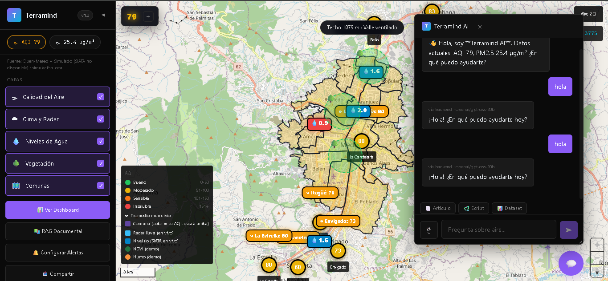
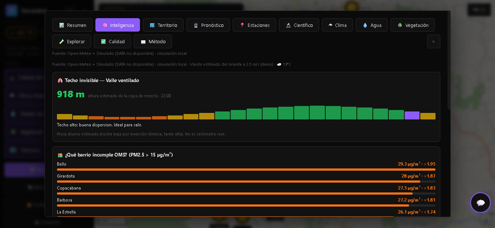
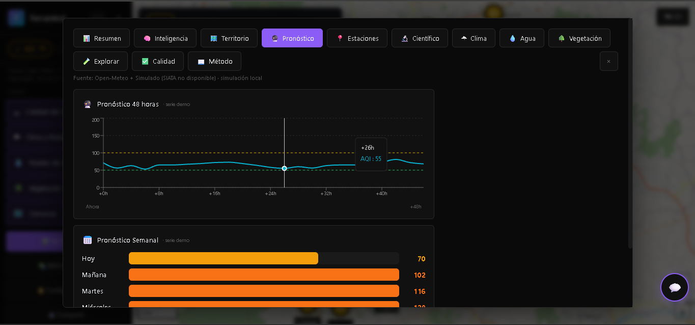
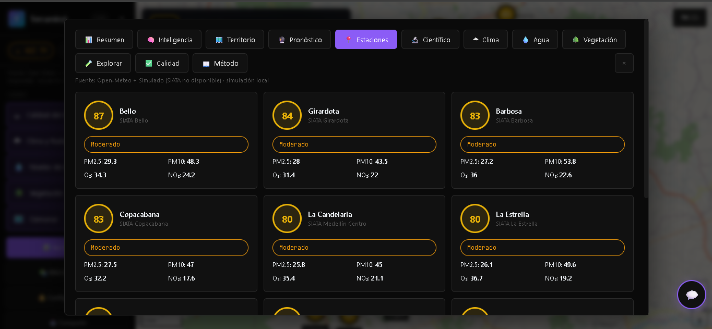
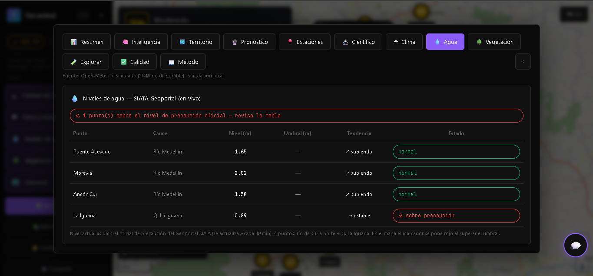
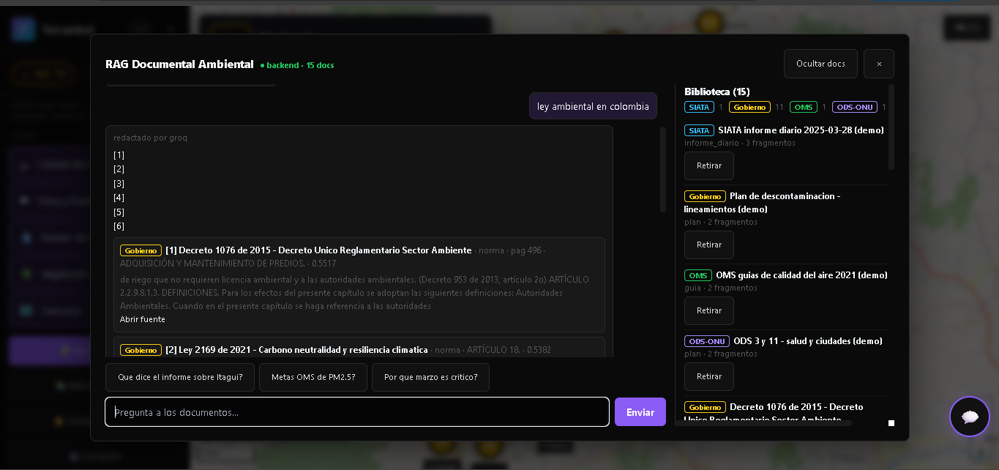
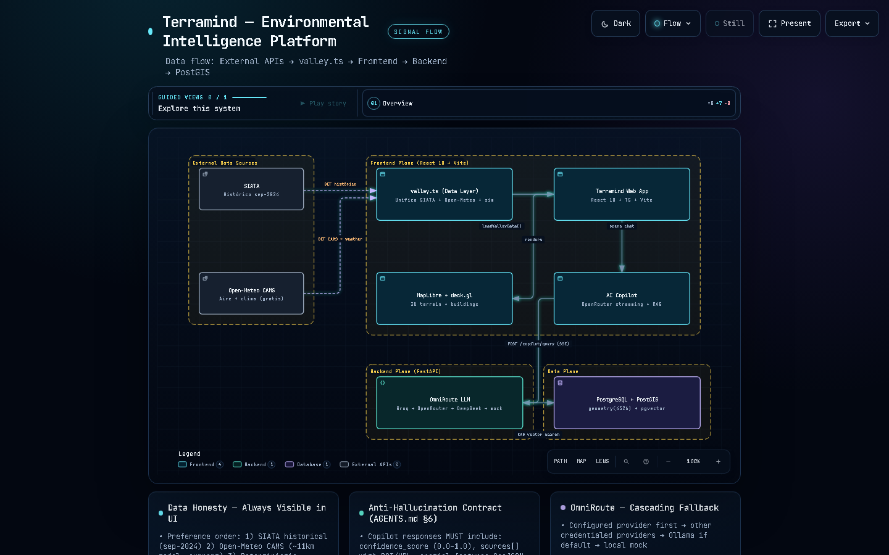

# 🌎 Terramind — Environmental Intelligence Platform

> **Plataforma fullstack de inteligencia ambiental para el Valle de Aburrá, Colombia: mapa 3D interactivo, datos en tiempo real de calidad del aire y clima, y copiloto conversacional con IA.**

**🚀 Demo en vivo:** https://terramind-mu.vercel.app

<p align="center">
  
  
  
  
  
  
  
  
  
</p>

## 📸 Capturas


*Vista actual del mapa 3D: AQI del Valle con tarjeta de resumen, capas activas (aire, clima, agua, vegetación, comunas), edificios extruidos y panel de acciones.*



*Mapa 3D del Valle de Aburrá con comunas coloreadas por AQI, estaciones de calidad del aire (PM2.5/PM10), niveles de agua y copiloto de IA respondiendo en vivo.*



*Pestaña Inteligencia: techo de mezcla estimado (capa de inversión térmica) y ranking de barrios que incumplen el estándar OMS de PM2.5.*



*Pestaña Pronóstico: serie 48 horas con intervalo y pronóstico semanal por día.*



*Pestaña Estaciones: red SIATA por municipio con AQI, PM2.5/PM10, O₃ y NO₂.*



*Pestaña Agua: niveles del Río Medellín y quebradas desde el Geoportal SIATA en vivo, con alerta sobre el umbral de precaución.*



*Panel RAG Documental: biblioteca de 15 documentos (normativa colombiana, guías OMS, ODS), respuestas con citas y subida de archivos para indexar.*

## ✨ ¿Qué es?

**Terramind** es una aplicación fullstack que unifica visualización geoespacial 3D, redes de sensores en tiempo real e IA conversacional en un solo panel:

- 🗺️ **Mapa 3D interactivo** (MapLibre GL + deck.gl): estaciones de calidad del aire, radar de lluvia, niveles de agua y vegetación
- 🌫️ **Datos reales**: red de monitoreo SIATA, Open-Meteo y RainViewer, con modo demo sin conexión
- 🤖 **Copiloto de IA**: preguntas en lenguaje natural sobre los datos, con enrutamiento multi-proveedor (Groq, Gemini, OpenRouter)
- 📊 **Dashboards**: AQI, PM2.5/PM10, histórico, alertas y reportes por zona

## 📍 Estado del proyecto (verificado en código)

| Capacidad | Estado | Evidencia |
|---|---|---|
| Mapa 3D con terreno + edificios extruidos | ✅ Activo (con toggle) | `AirMap.tsx` (setTerrain), `MapViewport.tsx`, `basemaps.ts` (fill-extrusion) |
| Dashboard overlay con 11 pestañas | ✅ Cableado | `App.tsx:395` (`dashboardOpen && <AirDashboard/>`) |
| Chat con streaming SSE | ✅ Activo | `ChatWidget.tsx`, `openRouter.ts` (getReader) |
| Datos híbridos SIATA + Open-Meteo + simulado | ✅ Activo | `valley.ts` (anti-corruption layer, 17 servicios) |
| Backend FastAPI (copilot, health, rag, spatial) | ✅ Implementado | `apps/api/app/api/v1/endpoints/` |
| RAG documental + OmniRoute multi-LLM | ✅ Implementado | `apps/api/app/rag/`, `core/llm.py` |
| Pronóstico 48h/semanal, alertas, compartir | ✅ Implementado | `predictions.ts`, `AlertsPanel.tsx`, `share.ts` |
| Datos 100% en vivo sin fallback | ⏳ Pendiente | UI opera con SIATA histórico + Open-Meteo + simulado determinista |
| Diseño móvil responsivo | ⏳ Pendiente | Desktop-first (ver PRD §9) |

## 🛠️ Stack

| Capa | Tecnologías |
|------|--------------|
| Frontend | React 18, TypeScript, Vite, Tailwind CSS, Zustand, Recharts, MapLibre GL, deck.gl |
| Backend | Python, FastAPI, Pydantic v2, enrutamiento multi-LLM |
| Datos | PostgreSQL + PostGIS, Redis, APIs REST (SIATA, Open-Meteo, RainViewer) |
| Calidad | Vitest + Testing Library (15 suites), pytest backend (4 módulos), ESLint, GitHub Actions (CI) |
| Deploy | Docker, Vercel (frontend), Railway/Fly.io (backend) |

## ⚡ Uso local (2 minutos, sin backend)

```bash
git clone https://github.com/Marusan94/Terramind.git
cd terramind/apps/web
npm install
npm run dev
# Abrir http://localhost:5173 — funciona en modo demo sin API keys
```

Con backend completo y API keys (opcionales), ver la instalación completa abajo.

<details>
<summary><strong>Instalación completa (backend + base de datos)</strong></summary>

```bash
# 1. Infraestructura (PostgreSQL + PostGIS + Redis)
docker compose up -d

# 2. Backend
cd apps/api
python -m venv .venv
.\.venv\Scripts\Activate.ps1   # Windows | source .venv/bin/activate en macOS/Linux
pip install -r requirements.txt
uvicorn app.main:app --reload --port 8000
# API Docs: http://localhost:8000/docs

# 3. Variables de entorno (opcionales — sin ellas activa modo demo)
cp .env.example .env
# Conseguir keys gratuitas: Gemini (aistudio.google.com/apikey), Groq (console.groq.com/keys)
```

</details>

## 🧪 Tests

```bash
cd apps/web && npm test        # 15 suites Vitest
cd apps/api && pytest          # 4 módulos de tests backend
```

## 🏗️ Arquitectura



*Diagrama interactivo: [`docs/architecture-terramind.html`](./docs/architecture-terramind.html) — ábrelo en el navegador para explorar nodos, trazar rutas (`R`), ver alcance upstream/downstream, comparar roles (`L`), modo presentación (`F`) y exportar (`E`). Fuente versionada: [`docs/architecture-terramind.json`](./docs/architecture-terramind.json) (generado con [Archify](https://github.com/tt-a1i/archify), validación showcase 9/9).*

<details>
<summary><strong>Diagrama ASCII (resumen)</strong></summary>

```
                React 18 + TypeScript (MapLibre + deck.gl)
                              │
                ┌─────────────┴─────────────┐
                │                           │
        🗺️ 3D MAP VIEWPORT           🤖 AI COPILOT (Groq/Gemini/OpenRouter)
                │                           │
                └─────────────┬─────────────┘
                              ▼
                       FASTAPI BACKEND
                              │
         ┌────────────────────┼────────────────────┐
         ▼                    ▼                    ▼
   PostGIS + Redis     SIATA / Open-Meteo    Caché de mosaicos
   (espacial)          / RainViewer          + modo demo
```

</details>

## 📚 Documentación

| Documento | Descripción |
|-----------|-------------|
| [01_ARCHITECTURE.md](./docs/engineering/01_ARCHITECTURE.md) | Arquitectura del sistema |
| [07_API_CONTRACT.md](./docs/engineering/07_API_CONTRACT.md) | Documentación de la API REST |
| [AGENTS.md](./AGENTS.md) | Guía del sistema multi-agente |
| [CONTRIBUTING.md](./CONTRIBUTING.md) | Cómo contribuir |

## 👨‍💻 Autor

**Santiago Marulanda** — *Desarrollador de Software* — [@Marusan94](https://github.com/Marusan94)
- Licenciatura en Ciencias Naturales y Educación Ambiental — Universidad de Antioquia
- Técnico en Desarrollo de Software — Cesde
- 📧 santiago.marulandal@udea.edu.co · 📍 Medellín, Colombia

## 📜 Licencia

Apache 2.0 — ver [LICENSE](./LICENSE).

## 🙏 Fuentes de datos

**SIATA** (Área Metropolitana del Valle de Aburrá) · **Open-Meteo** · **RainViewer** · **OpenStreetMap** · **MapLibre** · **deck.gl**

## 📚 Biblioteca RAG

Normativa ambiental oficial indexada para el copiloto con citas (`data/rag_library/` — ver `MANIFEST.csv` y `README_INGESTA.md`):

| Documento | Chunks | Estado |
|---|---|---|
| Decreto 1076/2015 — Decreto Único Sector Ambiente | 4,899 | ✅ Ingerido |
| Ley 99/1993 — Crea MinAmbiente y SINA | 326 | ✅ Ingerido |
| Ley 1333/2009 — Régimen sancionatorio ambiental | 108 | ✅ Ingerido |
| Res. 627/2006 — Ruido ambiental | 145 | ✅ Ingerido |
| Constitución 1991 — Derecho al ambiente sano | 664 | ✅ Ingerido |
| NTC-ISO 14001/2015 — Gestión ambiental | 257 | ✅ Ingerido |
| Ley 1931/2018 — Cambio climático | 106 | ✅ Ingerido |
| Ley 2169/2021 — Carbono neutralidad | 175 | ✅ Ingerido |
| NDC Colombia (MinAmbiente) | 23 | ✅ Ingerido |
| Res. 631/2015 — Vertimientos (HTML oficial) | 346 | ✅ Ingerido |
| Res. 2254/2017 — Calidad del aire (HTML oficial) | 17 | ✅ Ingerido |
| Res. 631/2015 y 2254/2017 (PDF MinAmbiente) | 0 | ⚠️ Escaneados sin texto — se indexa la versión HTML |
| NDC 3.0 y E2050 Colombia (UNFCCC) | — | ⏳ Descarga manual pendiente (ver MANIFEST) |

- **Recarga**: el RAG en memoria se pierde al reiniciar el API — ver comandos de re-ingesta en `data/rag_library/README_INGESTA.md`.

---

<p align="center"><strong>🌎 Pregunta a los datos. • 🤖 La IA responde. • 🗺️ El mapa lo muestra.</strong><br>Hecho en Medellín, Colombia</p>
