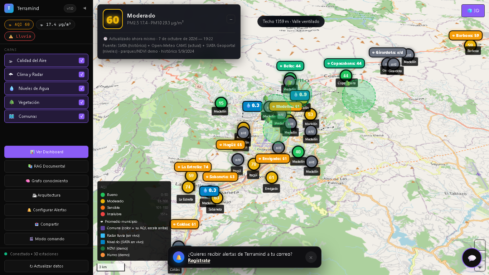
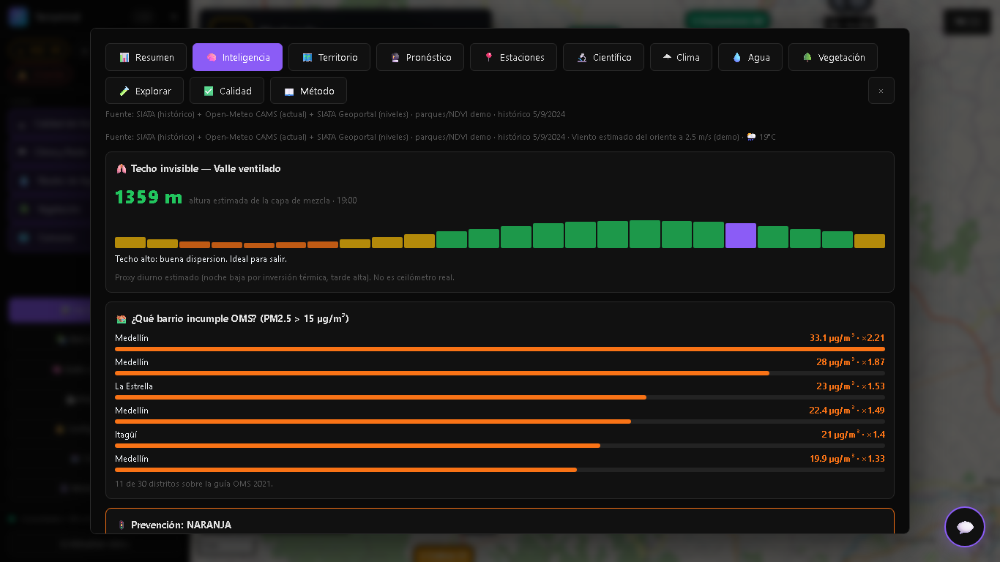
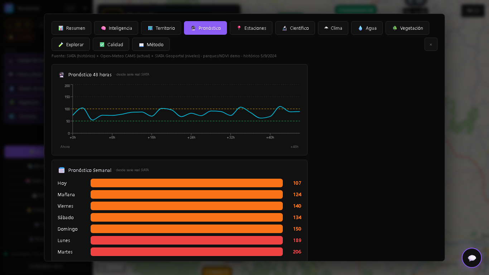
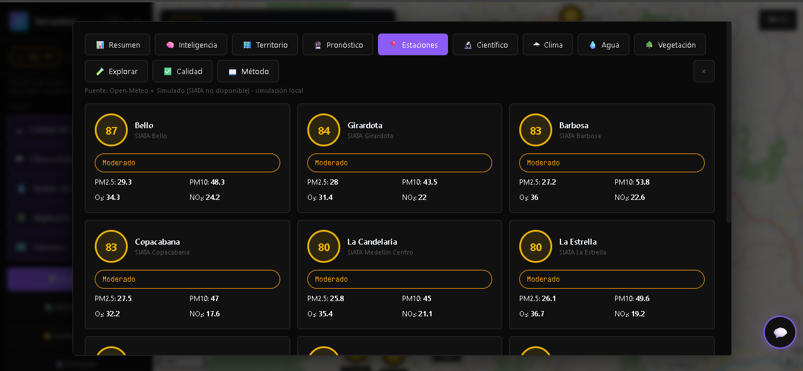
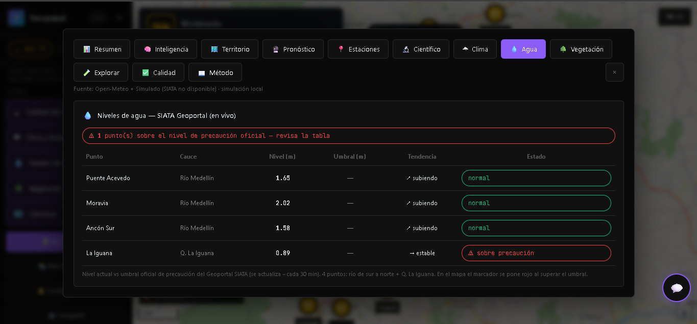
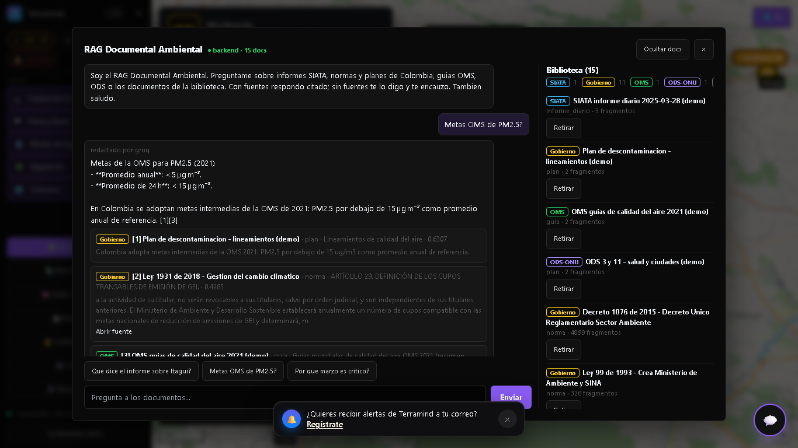
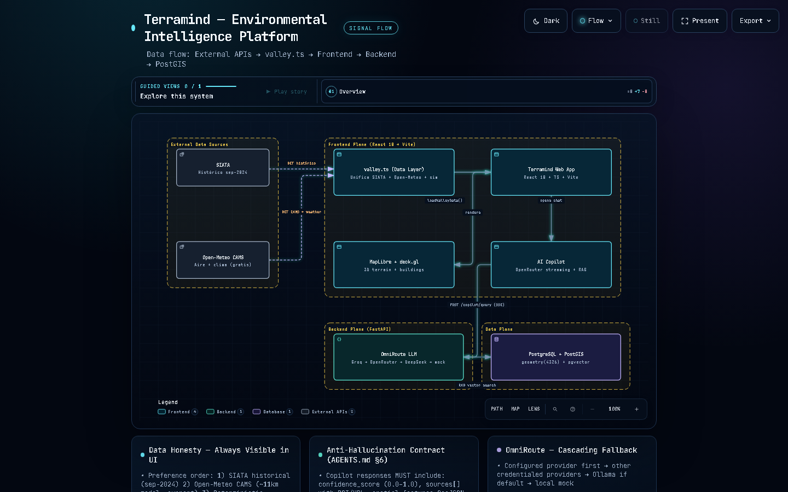

<p align="center">
  <h1 align="center">🌎 Terramind</h1>
  <p align="center"><strong>Environmental intelligence for Valle de Aburrá, Colombia.</strong><br>Interactive 3D map, air & climate data, and an AI copilot that answers with citations.<br><a href="https://terramind-mu.vercel.app"><strong>🚀 Live Demo → terramind-mu.vercel.app</strong></a></p>
  <p align="center">
    
    
    
    
    
    
    
    
    
  </p>
</p>

## 🧭 El proyecto en breve

**Copiloto IA sobre datos ambientales**

- **Problema:** Los datos de calidad del aire existen pero nadie los entiende.
- **Automatización:** Mapa 3D + copiloto multi-LLM con RAG normativo: preguntas en español, responde con fuentes.
- **Resultado:** Cualquiera consulta el aire de su ciudad sin saber de datos.

`React` · `FastAPI` · `PostGIS` · `RAG` — [Demo →](https://terramind-mu.vercel.app) · [Código →](https://github.com/Marusan94/Terramind)

## Table of Contents

- [Screenshots](#-screenshots)
- [Features](#-features)
- [Tech Stack](#️-tech-stack)
- [Quickstart](#-quickstart)
- [Usage](#-usage)
- [Architecture](#️-architecture)
- [Documentation](#-documentation)
- [Demo](#-demo-en-vivo)
- [Contributing](#-contributing)
- [License](#-license)

## 📸 Screenshots


*3D AQI map of the valley: summary card, active layers (air, weather, water, vegetation, comunas), extruded buildings, action panel.*



*Comunas colored by AQI, PM2.5/PM10 stations, water levels, and the AI copilot answering.*



*Intelligence tab: estimated mixing height (thermal inversion layer) and neighborhoods above the WHO PM2.5 standard.*



*Forecast tab: hourly series with intervals plus a multi-day outlook.*



*Stations tab: SIATA network by municipality with AQI, PM2.5/PM10, O₃, NO₂.*



*Water tab: Medellín River and stream levels, with precaution-threshold alerts.*



*RAG panel: Colombian regulation + WHO guides library, cited answers, file upload for indexing.*

## ✨ Features

- 🗺️ **Interactive 3D map** (MapLibre GL + deck.gl): air stations, water levels, vegetation, terrain + extruded buildings
- 🌫️ **Honest data layer**: SIATA historical dataset + Open-Meteo air quality/weather, with deterministic demo fallback when offline — no API keys required for demo mode
- 🤖 **AI copilot**: natural-language questions over valley data, multi-provider routing (Groq, OpenRouter, Ollama), SSE streaming
- 📚 **Document RAG**: Colombian environmental norms + WHO guides, answers with citations, upload-to-index flow
- 📊 **Layer-driven dashboard**: overview, territory, forecast, stations, water, intelligence and RAG views, plus alerts and share links
- 🔁 **FastAPI backend**: `copilot`, `health`, `rag` and `spatial` endpoints with Swagger docs at `/docs`

## 🛠️ Tech Stack

| Layer | Technologies |
|-------|--------------|
| Frontend | React 18, TypeScript 5.4, Vite 5, Tailwind CSS 3, Zustand, Recharts, MapLibre GL 4, deck.gl 9 |
| Backend | Python 3.11, FastAPI, Pydantic v2, multi-LLM routing (Groq, OpenRouter, Ollama) |
| Data | PostgreSQL 16 + PostGIS 3.4, Redis 7, REST (SIATA, Open-Meteo) |
| Quality | Vitest + Testing Library (17 suites), pytest (4 modules), ESLint, GitHub Actions |
| Deploy | Docker Compose, Vercel (web), Railway/Fly.io (API) |

## ⚡ Quickstart

```bash
# 2 minutes, no backend — demo mode
git clone https://github.com/Marusan94/Terramind.git
cd terramind/apps/web
npm install
npm run dev
# Open http://localhost:5173
```

<details>
<summary><strong>Full install (backend + database)</strong></summary>

```bash
# 1. Infra (PostgreSQL + PostGIS + Redis)
docker compose up -d

# 2. Backend
cd apps/api
python -m venv .venv
# Windows:
.\.venv\Scripts\Activate.ps1
# macOS/Linux:
# source .venv/bin/activate
pip install -r requirements.txt
uvicorn app.main:app --reload --port 8000
# API docs: http://localhost:8000/docs

# 3. Env (optional — without keys demo mode kicks in)
cp .env.example .env
# Free keys: Groq (console.groq.com/keys), OpenRouter (openrouter.ai/keys)
```

</details>

```bash
# Tests
cd apps/web && npm test        # 17 Vitest suites
cd apps/api && pytest          # 4 backend modules
```

## 💡 Usage

```bash
# Health check
curl http://localhost:8000/health
```

- **Ask the copilot**: `¿Cuál es el PM2.5 ahora en Laureles y supera la norma OMS?` → cited answer + map highlight.
- **Forecast flow**: open *Pronóstico* → pick a comuna → read the hourly band + multi-day cards.
- **RAG flow**: open *RAG Documental* → ask `¿Qué dice el Decreto 1076 sobre vertimientos?` → answer with document chunks.

## 🏗️ Architecture



*Interactive version: [`docs/architecture-terramind.html`](./docs/architecture-terramind.html) — explore nodes, trace routes (`R`), upstream/downstream scope, role compare (`L`), present (`F`), export (`E`). Versioned source: [`docs/architecture-terramind.json`](./docs/architecture-terramind.json).*

```
        React 18 + TypeScript (MapLibre + deck.gl)
                          │
            ┌─────────────┴─────────────┐
            │                           │
    🗺️ 3D MAP VIEWPORT           🤖 AI COPILOT (Groq/OpenRouter/Ollama)
            │                           │
            └─────────────┬─────────────┘
                          ▼
                   FASTAPI BACKEND
                   (copilot, health,
                    rag, spatial)
                          │
      ┌───────────────────┼───────────────────┐
      ▼                   ▼                   ▼
PostGIS + Redis     SIATA historical    Demo fallback
(spatial)           + Open-Meteo live   (deterministic)
```

## 📚 Documentation

| Document | Description |
|-----------|-------------|
| [01_ARCHITECTURE.md](./docs/engineering/01_ARCHITECTURE.md) | System architecture |
| [07_API_CONTRACT.md](./docs/engineering/07_API_CONTRACT.md) | REST API contract |
| [AGENTS.md](./AGENTS.md) | Multi-agent guide |
| [CONTRIBUTING.md](./CONTRIBUTING.md) | How to contribute |
| [RAG ingest guide](./data/rag_library/README_INGESTA.md) | Re-index commands (in-memory RAG resets on API restart) |

## 🎮 Demo en vivo

[https://terramind-mu.vercel.app](https://terramind-mu.vercel.app) — modo demo sin API keys (datos simulados determinísticos). Con keys (Groq/OpenRouter) → copilot + RAG real.

## 🎥 Demo en video

[](docs/demo-terramind.mp4)
*Recorrido 60s: mapa 3D → capas aire/agua → copiloto con cita → pronóstico.*

> Graba con el demo en vivo, guarda en `docs/demo-terramind.mp4`, súbelo a YouTube/Loom y reemplaza este link.

## 🤝 Contributing

Fork → branch (`feat/map: ...`) → `npm test` + `pytest` → PR with screenshots for UI changes. See [CONTRIBUTING.md](./CONTRIBUTING.md).

## 📜 License

Apache-2.0 — see [LICENSE](./LICENSE). Data: **SIATA** (Área Metropolitana del Valle de Aburrá) · **Open-Meteo** · **OpenStreetMap** · **MapLibre** · **deck.gl**.

---

<p align="center"><strong>🌎 Ask the data. • 🤖 AI answers. • 🗺️ The map shows it.</strong><br>Built in Medellín, Colombia — by <a href="https://github.com/Marusan94">@Marusan94</a></p>
